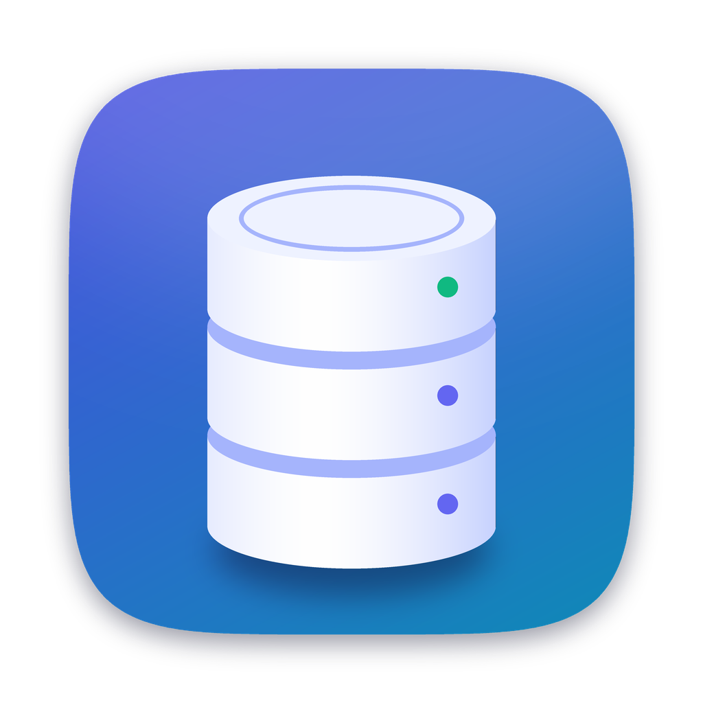

<p align="center">
  
</p>

<h1 align="center">DB Manager</h1>

<p align="center">
  <b>A lightweight, native PostgreSQL + Redis client for macOS and Windows.</b><br>
  No Electron, no JVM: just C++20 and Qt 6. Free and open source.
</p>

<p align="center">
  <a href="https://github.com/thanakorn1999/db-manager/actions/workflows/windows.yml"></a>
  <a href="LICENSE"></a>
  
  
</p>

## Why

GUI database tools tend to be either heavy (Electron / Java, seconds to start, hundreds of MB of RAM) or paid.
DB Manager is a small native app that does the everyday work well: write SQL with smart autocomplete,
browse and edit data, follow foreign keys, export, and look after Redis keys, all in one window.

## Highlights

- **SQL editor that knows your schema**: suggestions follow the clause you're in; after `JOIN`, tables
  linked by a foreign key come first with the whole `ON` condition filled in. Unknown tables / columns get a yellow underline.
- **Edit data in the grid**: change cells, add / delete rows (JOIN results too), ⌘Z undo, save in one transaction.
- **Filter and sort without losing the SQL**: ⌘F and header clicks write `WHERE` / `ORDER BY` into your query, so you always see what ran.
- **Follow foreign keys**: click the → in an FK cell to open the parent row; the PK / FK ⋮ menu writes the `JOIN` for you.
- **Copy as JSON / CSV / Markdown / SQL INSERT**: select cells, right-click.
- **Export**: CSV, Excel (.xlsx), JSON (data + structure), SQL INSERTs; a whole database or schema into one `.zip`. Backup with `pg_dump`.
- **Safe drops**: dropping tables lists the tables whose foreign keys point at them (drop those too, or CASCADE); Drop Database confirms first.
- **ER diagram** of a database, schema or table.
- **Redis**: SCAN key browser with search, editors for string / hash / list / set / sorted set, TTL, rename, command editor.
- **Explorer**: open a database like a folder, multi-select tables, emoji icons guessed from table names.
- Passwords live in the OS keychain (macOS Keychain / Windows Credential Manager).

## Get it

- **Windows**: download the `db-manager-windows-x64` artifact from the latest green
  [Windows build](https://github.com/thanakorn1999/db-manager/actions/workflows/windows.yml) run (needs a GitHub login), see [Prebuilt (CI)](#prebuilt-ci).
- **macOS**: build from source with Homebrew (below). Signed releases are on the [roadmap](ROADMAP.md).

Like it? A ⭐ helps other people find it. Ideas and bugs: [open an issue](https://github.com/thanakorn1999/db-manager/issues).

## Build (macOS)

```sh
brew install cmake qt qtkeychain libpq hiredis
cmake -S . -B build -DCMAKE_PREFIX_PATH="$(brew --prefix qt);$(brew --prefix qtkeychain);$(brew --prefix libpq)"
cmake --build build -j
open build/db-manager.app
```

## Build (Windows)

> Not tested on Windows yet. If something breaks, please open an issue or a PR.

Needs **Visual Studio 2022** (workload *Desktop development with C++*), **CMake 3.21+** and **Git**. Dependencies come from [vcpkg](https://github.com/microsoft/vcpkg) via `vcpkg.json`.

```powershell
# once: get vcpkg
git clone https://github.com/microsoft/vcpkg C:\vcpkg
C:\vcpkg\bootstrap-vcpkg.bat

# configure + build (the first configure compiles Qt and the other deps: about an hour)
cmake -S . -B build -DCMAKE_TOOLCHAIN_FILE=C:/vcpkg/scripts/buildsystems/vcpkg.cmake -DVCPKG_TARGET_TRIPLET=x64-windows
cmake --build build --config Release

# copy the Qt plugins next to the exe, then run
build\vcpkg_installed\x64-windows\tools\Qt6\bin\windeployqt.exe build\Release\db-manager.exe
build\Release\db-manager.exe
```

**Backup** runs `pg_dump`: install PostgreSQL (or just its command-line tools) and add its `bin` folder to `PATH`.

Dev loop: after the setup above, only changed files recompile and `windeployqt` doesn't need to run again.

```powershell
cmake --build build --config Release; if ($?) { build\Release\db-manager.exe }
```

- **Visual Studio:** open `build\db-manager.sln`, set `db-manager` as the startup project, pick Release, F5.
- **VS Code:** CMake Tools extension with
  `"cmake.configureSettings": { "CMAKE_TOOLCHAIN_FILE": "C:/vcpkg/scripts/buildsystems/vcpkg.cmake", "VCPKG_TARGET_TRIPLET": "x64-windows" }`.
- Stick to Release for now; Debug needs the Qt debug DLLs deployed and hasn't been checked.

### Prebuilt (CI)

Every push builds on GitHub Actions (`.github/workflows/windows.yml`). Open the run under **Actions**, download the `db-manager-windows-x64` artifact (needs a GitHub login), unzip it and run `db-manager.exe`.

- Keep the whole folder: the exe needs the DLLs and `platforms/` next to it.
- The exe isn't signed, so SmartScreen warns: **More info → Run anyway**.
- Missing `VCRUNTIME140.dll` / `MSVCP140.dll`: install the *Microsoft Visual C++ Redistributable (x64)*.

## Test

```sh
ctest --test-dir build                                   # unit checks
DBM_TEST_PG=localhost:5432 DBM_TEST_REDIS=127.0.0.1:6379 ctest --test-dir build --output-on-failure
```

Windows (PowerShell):

```powershell
ctest --test-dir build -C Release --output-on-failure
$env:DBM_TEST_PG="localhost:5432"; $env:DBM_TEST_REDIS="127.0.0.1:6379"; ctest --test-dir build -C Release --output-on-failure
```

The Redis live test uses DB 15 and runs `FLUSHDB` on it.

## Shortcuts (⌘ = Ctrl on Windows/Linux)

| Key | Action |
| --- | --- |
| ⌘N | New connection |
| ⌘T | New SQL editor (selected PostgreSQL connection/database) |
| ⌘R | Refresh selected explorer node |
| ⌘W | Close current tab |
| ⌃⇥ / ⌃⇧⇥, ⌘⇧] / ⌘⇧[ | Next / previous tab |
| ⌘1…⌘8, ⌘9 | Go to tab N, last tab |
| ⌘↵ | Run SQL (selection only if text is selected) |
| ⌘. | Cancel running query |
| ⌘, | Settings (result grid colours) |
| ⌃Space | SQL: show suggestions (they also pop up while typing; Tab / ↵ accepts, Esc closes) |
| ⌘C | Copy selected cells (tab-separated); right-click → Copy as JSON / CSV / Markdown / SQL INSERT |
| ⌘S | Save grid edits (SQL) / save string value (Redis) |
| ⌘⌫ / Delete | SQL grid: mark selected rows for deletion (again to unmark) |
| ⌘F | Redis: focus key pattern |
| ⌫ / Delete | Redis: delete selected key / selected items (asks first) |

## SQL autocomplete

Suggestions follow the clause you're in: statement keywords at the start, tables after `FROM` / `JOIN` / `UPDATE` / `INTO`, columns of the tables in the statement (`alias.` narrows to one table; names found in several tables are qualified), and the next likely keywords (`WHERE`, `JOIN`, `ORDER BY`, `AND`…).
After `JOIN`, tables linked by a foreign key come first with the condition filled in — picking `orders o ON o.user_id = u.id` writes the whole thing. The catalog reloads after `CREATE` / `ALTER` / `DROP`.

## Result grid

- **Column tags** — coloured dots in the header: PK, FK, UNIQUE, INDEX (hover for details, e.g. `FK → public.users(id)`). Tag colours are in Settings (⌘,).
- **Foreign keys** — FK cells get a → on the right; click it to open the parent row in a new tab (`SELECT * FROM parent WHERE pk = value`). Composite FKs work when all their columns are in the result.
- **Value colours** (Settings) — text / background for TRUE, FALSE, NULL, empty text (shown as `<EMPTY>`), "not important" columns, and optionally key columns (off by default: the header tags mark them). Edit highlights win over all of these.
- Rows alternate colours.

## Databases

Opening a PostgreSQL database (double-click or ▸) goes inside it, like a folder: the explorer shows only that database's schemas and tables. The bar on top switches to another database of the same connection, and **‹ connection** (⌘[) goes back to the full list.

## Table icons

Tables in the explorer get an emoji guessed from their name (`users` → 🧑, `orders` → 🧾, `products` → 📦, `user_roles` → 🔑 — the last word counts most); no match keeps the file icon. Right-click → **Set Icon…** to pick another or type any emoji; **Automatic** goes back to the guess. Emoji you type there are kept under **My icons** at the top of the picker (right-click one to remove it). Stored per `schema.table`, shared by all connections.

## Editing

- **PostgreSQL** — any result from a single table that includes its primary key is editable: double-click a cell, `+ Row`, `− Row`, `Set NULL`, then **Save** (one transaction; every UPDATE/DELETE must hit exactly one row or nothing is written). The status bar says why a result is read-only.
- **Redis** — edits are written immediately: hash/list values, set/zset members, zset scores (double-click), `+ Add` / `− Remove` items, `+ Key`, `Rename…`, `TTL…`, string values (`Save`, keeps the TTL).

## Export

Right-click a **table** → **Export…** saves that table (CSV / Excel / JSON / SQL INSERTs); the SQL tab's **Export…** saves its result grid the same way. Right-click a **database** or **schema** → **Export…**: pick the format (CSV / Excel / JSON), tick tables (or **Select all**), then either **One .zip file** (default) or, unticked, a folder with one file per table, `schema.table.ext` (you're asked before existing files are replaced). Save dialogs start in Downloads.

## Contributing

Pick an unchecked item in [ROADMAP.md](ROADMAP.md), open an issue to say you're on it, then send a PR. Code: `src/core` (database access, SQL completion, export; no Qt Widgets, unit-tested in `tests/core_test.cpp`) and `src/ui` (Qt Widgets).

## License

[MIT](LICENSE) © 2026 Jamezarkk. Roadmap: [ROADMAP.md](ROADMAP.md).
